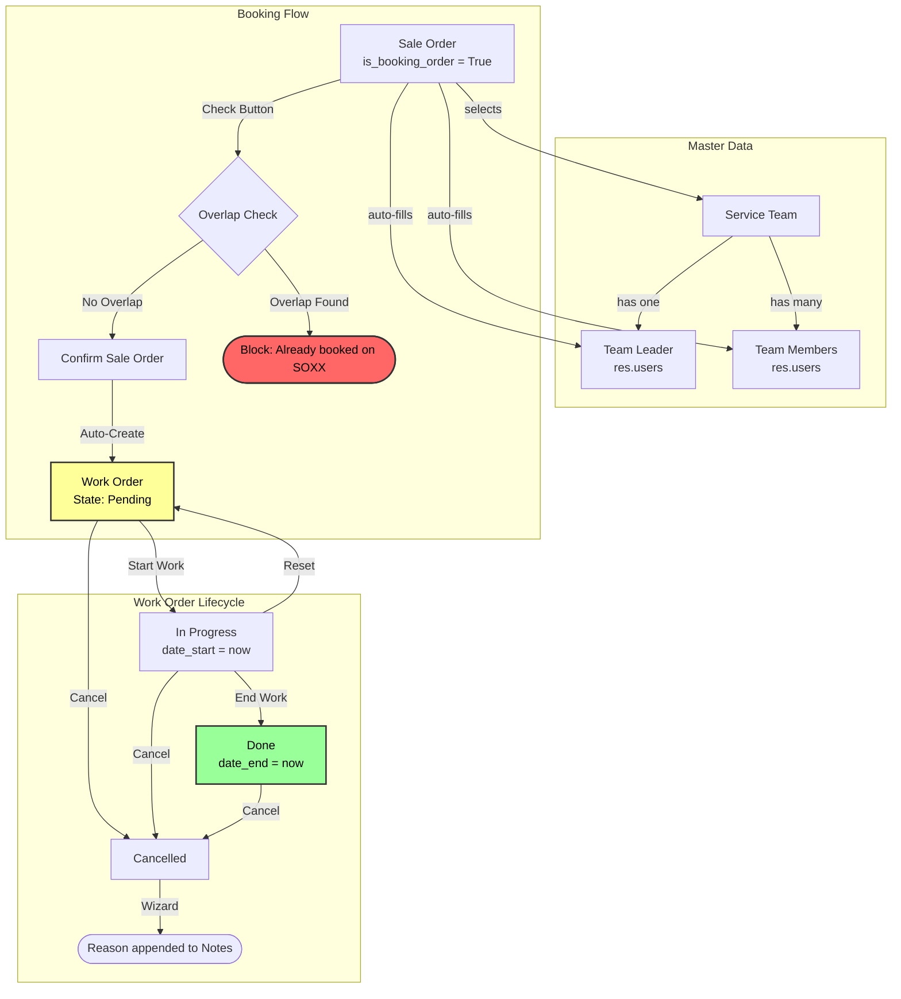

# Odoo Booking Order Module

[](https://www.odoo.com/)
[](https://www.python.org/)
[](https://www.gnu.org/licenses/lgpl-3.0.en.html)

A custom Odoo module that extends the Sales workflow with a **Booking Order** system for service-based businesses. The module introduces Service Team management, schedule overlap detection, automatic Work Order generation upon booking confirmation, and a printable Work Order report.

## 📊 System Architecture



## 📖 Module Overview

The module adds three interconnected components to the Odoo Sales workflow:

- **Service Team**: Master data model for defining teams with a leader and members, used as the resource pool for bookings.
- **Booking Order**: Extends `sale.order` with booking-specific fields (schedule, team assignment) and enforces schedule conflict detection before confirmation.
- **Work Order**: Auto-generated upon booking confirmation, tracks the execution lifecycle from Pending → In Progress → Done, with cancellation support via a wizard that captures the reason.

## 🛠️ Technical Implementation

### Models

#### `service.team` — Service Team

| Field             | Type                     | Description                       |
| :---------------- | :----------------------- | :-------------------------------- |
| `name`            | `Char`                   | Team name (required)              |
| `team_leader_id`  | `Many2one → res.users`   | Designated team leader (required) |
| `team_member_ids` | `Many2many → res.users`  | Team member list                  |
| `company_id`      | `Many2one → res.company` | Multi-company support             |

#### `sale.order` — Booking Order (inherited)

| Field              | Type                      | Description                             |
| :----------------- | :------------------------ | :-------------------------------------- |
| `is_booking_order` | `Boolean`                 | Flags the SO as a booking order         |
| `service_team_id`  | `Many2one → service.team` | Assigned service team                   |
| `team_leader_id`   | `Many2one → res.users`    | Auto-filled from service team (related) |
| `team_member_ids`  | `Many2many → res.users`   | Auto-filled from service team (related) |
| `booking_start`    | `Datetime`                | Booking period start                    |
| `booking_end`      | `Datetime`                | Booking period end                      |
| `work_order_count` | `Integer`                 | Computed count of linked work orders    |

#### `work.order` — Work Order

| Field              | Type                      | Description                                         |
| :----------------- | :------------------------ | :-------------------------------------------------- |
| `wo_number`        | `Char`                    | Auto-generated sequence (prefix: `WO`, e.g., WO001) |
| `booking_order_id` | `Many2one → sale.order`   | Back-reference to the booking order (readonly)      |
| `team_id`          | `Many2one → service.team` | Assigned team (required)                            |
| `team_leader_id`   | `Many2one → res.users`    | Related from team (required)                        |
| `team_member_ids`  | `Many2many → res.users`   | Related from team                                   |
| `planned_start`    | `Datetime`                | Scheduled start (required)                          |
| `planned_end`      | `Datetime`                | Scheduled end (required)                            |
| `date_start`       | `Datetime`                | Actual start (set by "Start Work" action, readonly) |
| `date_end`         | `Datetime`                | Actual end (set by "End Work" action, readonly)     |
| `state`            | `Selection`               | Pending → In Progress → Done / Cancelled            |
| `notes`            | `Text`                    | Notes field (cancellation reason appended here)     |

### Core Business Logic

#### Schedule Overlap Detection

```python
def check_overlap(self, order):
    overlapping_wo = self.env['work.order'].search([
        ('team_id', '=', order.service_team_id.id),
        ('team_leader_id', '=', order.team_leader_id.id),
        ('planned_start', '<=', order.booking_end),
        ('planned_end', '>=', order.booking_start),
    ]).filtered(lambda r: r.state != 'cancel')
    return overlapping_wo
```

The overlap check runs on both the **"Check" button** (advisory) and the **"Confirm" action** (blocking). It queries all active (non-cancelled) work orders for the same team and leader whose planned period intersects with the booking window.

#### Auto Work Order Creation

On `action_confirm()`, if no overlap is detected, the system:

1. Executes the standard `sale.order` confirmation flow
2. Auto-creates a `work.order` record with state `pending`, copying team, schedule, and booking reference data
3. Links the work order back to the booking order via `booking_order_id`

#### Cancellation Wizard

The cancellation flow uses a `TransientModel` wizard (`work.order.cancel.confirmation`) that:

1. Opens a popup dialog requesting a cancellation reason
2. Sets the work order state to `cancelled`
3. Writes the reason to the `notes` field

### Views

| View              | Model          | Types                                                                |
| :---------------- | :------------- | :------------------------------------------------------------------- |
| **Service Team**  | `service.team` | List, Form                                                           |
| **Booking Order** | `sale.order`   | List, Form (inherits standard SO form with booking fields in header) |
| **Work Order**    | `work.order`   | List, Kanban, Form, Calendar, Pivot, Graph                           |

### Work Order State Buttons

| Button         | Visible In  | Action                                                        |
| :------------- | :---------- | :------------------------------------------------------------ |
| **Start Work** | Pending     | Sets state → In Progress, records `date_start`                |
| **End Work**   | In Progress | Sets state → Done, records `date_end`                         |
| **Reset**      | In Progress | Sets state → Pending, clears `date_start`                     |
| **Cancel**     | All states  | Opens wizard, sets state → Cancelled, appends reason to notes |

### Printable Report

A QWeb-based PDF report for Work Orders, containing:

- Work Order number, Team name, Customer name
- Booking Order reference, Date range
- Notes section and Signature area

### Security (Access Control)

| Model          | Group          | Read | Write | Create | Delete |
| :------------- | :------------- | :--- | :---- | :----- | :----- |
| `service.team` | System (Admin) | ✓    | ✓     | ✓      | ✓      |
| `service.team` | Internal User  | ✓    | ✗     | ✗      | ✗      |
| `work.order`   | System (Admin) | ✓    | ✓     | ✓      | ✓      |
| `work.order`   | Internal User  | ✓    | ✓     | ✓      | ✗      |

### Menu Structure

```
Sales
└── Booking
    ├── Booking Order    → sale.order (is_booking_order = True)
    ├── Work Order       → work.order (list, kanban, form, calendar, pivot, graph)
    └── Service Team     → service.team (list, form)
```

## 🚀 Installation

1. Copy the `booking_order` directory into the Odoo 10 CE addons path:

   ```bash
   cp -r booking_order /path/to/odoo/addons/
   ```

2. Update the module list in Odoo:

   ```
   Settings → Apps → Update Apps List
   ```

3. Search for **"Booking Order"** and click **Install**.

### Dependencies

| Module       | Description                          |
| :----------- | :----------------------------------- |
| `base`       | Odoo core module                     |
| `sale`       | Sales module (provides `sale.order`) |
| `sales_team` | Sales Team module                    |

## 📂 Repository Structure

```
booking_order/
├── __init__.py
├── __manifest__.py
├── models/
│   ├── __init__.py
│   ├── service_team.py         # Service Team model
│   ├── sale_order.py           # Booking Order (sale.order extension)
│   └── work_order.py           # Work Order model with state machine
├── views/
│   ├── service_team_views.xml  # Service Team list & form views
│   ├── booking_order_views.xml # Booking Order form (inherits sale.order)
│   ├── work_order_views.xml    # Work Order list, kanban, form, calendar, pivot, graph
│   └── booking_menuitem.xml    # Menu structure under Sales
├── wizard/
│   ├── __init__.py
│   ├── work_order_cancel_confirmation.py       # Cancellation wizard logic
│   └── work_order_cancel_confirmation_view.xml # Cancellation popup form
├── report/
│   ├── work_order_report.xml          # Report action definition
│   └── work_order_report_template.xml # QWeb PDF template
├── security/
│   └── ir.model.access.csv    # Access control rules
└── data/
    └── ir_sequence_data.xml   # WO number sequence (prefix: WO)
```

---

_Developed by Adita Putri Puspaningrum._
